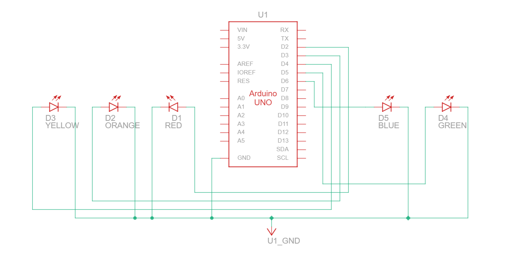

# 📘 Praktikum Sistem Tertanam - Modul 1 Perulangan

## Pertanyaan Praktikum

1. Gambarkan rangkaian schematic 5 LED running yang digunakan pada percobaan!
2. Jelaskan bagaimana program membuat efek LED berjalan dari kiri ke kanan!
3. Jelaskan bagaimana program membuat LED kembali dari kanan ke kiri!
4. Buatkan program agar LED menyala tiga LED kanan dan tiga LED kiri secara bergantian dan berikan penjelasan disetiap baris kode nya   

---

## ✅ Jawaban

### 1. Rangkaian schematic 5 LED running



---

### 2 dan 3. Penjelasan Efek LED Berjalan dari Kiri ke Kanan serta Penjelasan Efek LED Berjalan dari Kanan ke Kiri

### 📌 Source Code

```cpp
//Loop Induk
for (int ledPin = 2; ledPin < 7; ledPin++) { 
      digitalWrite(ledPin, HIGH); 
      delay(timer); 
      digitalWrite(ledPin, LOW);

      //Loop Anak
      for (int ledPin = 7; ledPin >= 2; ledPin--) { 
        digitalWrite(ledPin, HIGH); 
        delay(timer); 
        digitalWrite(ledPin, LOW); 
      } 
  }
```

### Penjelasan Alur Efek
1. **Looping Induk Step 1**
    - `digitalWrite(ledPin, HIGH);` : Menyalakan LED pada pin yang sedang diakses (pin 2)
    - `delay(timer);` : Memberikan jeda waktu
    - `digitalWrite(ledPin, LOW);` : Mematikan LED pada pin yang sedang diakses (pin 2)

2. **Looping Anak**
    - `digitalWrite(ledPin, HIGH);` : Menyalakan LED 
    - `delay(timer);` : Memberikan jeda waktu
    - `digitalWrite(ledPin, LOW);` : Mematikan LED 
    - Looping ini akan berjalan dari pin 7 hingga kondisi `ledPin >= 2` tidak terpenuhi

3. **Looping Induk Step 2**
    - Setelah looping anak selesai, program akan kembali masuk ke looping induk
    - `digitalWrite(ledPin, HIGH);` : Menyalakan LED pada pin yang sedang diakses (pin 3)
    - `delay(timer);` : Memberikan jeda waktu
    - `digitalWrite(ledPin, LOW);` : Mematikan LED pada pin yang sedang diakses (pin 3)

4. **Masuk Kembali ke Looping Anak**
    - `digitalWrite(ledPin, HIGH);` : Menyalakan LED 
    - `delay(timer);` : Memberikan jeda waktu
    - `digitalWrite(ledPin, LOW);` : Mematikan LED 
    - Looping ini akan berjalan dari pin 7 hingga kondisi `ledPin >= 2` tidak terpenuhi

5. **Alur ini terus berulang hingga kondisi `ledPin >= 2` pada looping induk tidak terpenuhi**

6. **Kemudian `void loop()` akan mengulang kembali dari awal**

**Penjelasan :**
Alur ini akan membuat efek LED berjalan dari kiri ke kanan, dengan loop induk merupakan efek kiri ke kanan(namun berjalan lambat) sedangkan loop anak merupakan efek kanan ke kiri(namun berjalan cepat)

### 4. Program agar LED menyala tiga LED kanan dan tiga LED kiri secara bergantian dengan perulangan

### 📌 Source Code

```cpp
int timer = 1000; // Waktu delay (1 detik). Semakin tinggi angkanya, semakin lambat.

void setup() { 
  // Gunakan loop for untuk menginisialisasi setiap pin sebagai output
  // Kita menggunakan pin 2 hingga 7 (total 6 LED)
  for (int ledPin = 2; ledPin <= 7; ledPin++) { 
    pinMode(ledPin, OUTPUT); 
  } 
} 

void loop() { 
  // --- FASE 1: 3 LED Kiri MENYALA, 3 LED Kanan MATI ---
  
  // Looping untuk menyalakan 3 LED kiri (pin 2, 3, dan 4)
  for (int ledPin = 2; ledPin <= 4; ledPin++) { 
    digitalWrite(ledPin, HIGH); 
  }
  
  // Looping untuk mematikan 3 LED kanan (pin 5, 6, dan 7)
  for (int ledPin = 5; ledPin <= 7; ledPin++) { 
    digitalWrite(ledPin, LOW); 
  }
  
  delay(timer); // Berikan jeda waktu
  
  // --- FASE 2: 3 LED Kiri MATI, 3 LED Kanan MENYALA ---
  
  // Looping untuk mematikan 3 LED kiri (pin 2, 3, dan 4)
  for (int ledPin = 2; ledPin <= 4; ledPin++) { 
    digitalWrite(ledPin, LOW); 
  }
  
  // Looping untuk menyalakan 3 LED kanan (pin 5, 6, dan 7)
  for (int ledPin = 5; ledPin <= 7; ledPin++) { 
    digitalWrite(ledPin, HIGH); 
  }
  
  delay(timer); // Berikan jeda waktu sebelum kembali mengulang
}
```

---

### Penjelasan Alur Program

1. **Inisialisasi Pin (`void setup`)**
   - Mendeklarasikan variabel `timer` untuk menampung angka 1000 (1 detik) sebagai pengatur jeda antar fase.
   - Program menggunakan perulangan `for (int ledPin = 2; ledPin <= 7; ledPin++)` agar kita tidak perlu menulis perintah `pinMode()` satu per satu. Perintah ini akan tereksekusi otomatis dari pin 2 sampai 7 dan mengaturnya menjadi `OUTPUT`.

2. **Fase 1: Kiri Menyala, Kanan Mati (`void loop`)**
   - Perulangan pertama (`ledPin = 2` sampai `4`) berfungsi menyalakan 3 LED bagian kiri satu persatu secara instan (karena tidak ada `delay` di dalam loop tersebut) sehingga terlihat menyala bersamaan.
   - Perulangan kedua (`ledPin = 5` sampai `7`) berfungsi menyapu bersih sisa LED bagian kanan agar dalam kondisi mati (`LOW`).
   - Setelah konfigurasi tercapai, program dijeda lewat `delay(timer)` sehingga kombinasi ini dapat dilihat secara utuh selama 1 detik (1000 ms).

3. **Fase 2: Kiri Mati, Kanan Menyala (`void loop`)**
   - Segera setelah jeda selesai, program bertransisi ke kondisi sebaliknya.
   - Perulangan ketiga (`ledPin = 2` sampai `4`) memastikan 3 LED bagian kiri semuanya mati (`LOW`).
   - Perulangan keempat (`ledPin = 5` sampai `7`) bertugas menyalakan 3 LED bagian kanan dengan mengirim sinyal `HIGH`.
   - Program kembali ditahan sesaat menggunakan `delay(timer)`.

4. **Siklus Utama Berlanjut**
   - Karena keseluruhan proses berjalan di dalam `void loop()`, siklus penyalaan dan pemadaman ini akan terus menerus mengulang langkah dari Fase 1. Pada akhirnya, tercipta ilusi efek 3 buah LED menyala bergantian antara bagian kiri dan kanan secara simultan tanpa henti.
