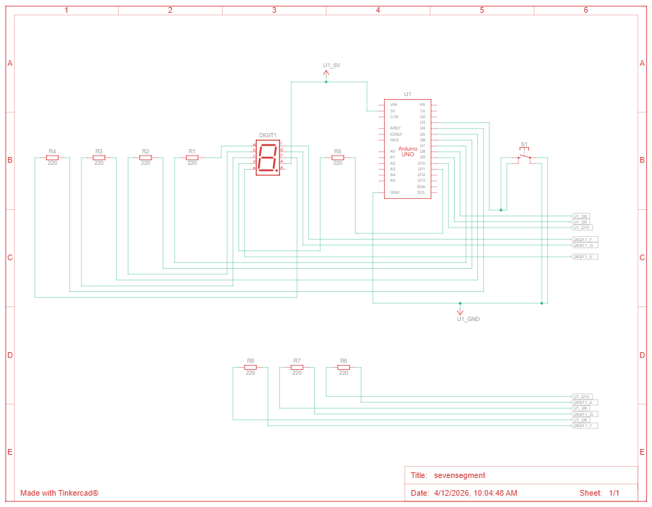

# 📘 Praktikum Sistem Tertanam - Modul 2 Kontrol Counter Dengan Push Button

## Pertanyaan Praktikum

1. Gambarkan rangkaian schematic yang digunakan pada percobaan!
2. Mengapa pada push button digunakan mode INPUT_PULLUP pada Arduino Uno? Apa keuntungannya dibandingkan rangkaian biasa?
3. Jika salah satu LED segmen tidak menyala, apa saja kemungkinan penyebabnya dari sisi hardware maupun software?
4. Modifikasi rangkaian dan program dengan dua push button yang berfungsi sebagai penambahan (increment) dan pengurangan (decrement) pada sistem counter dan berikan penjelasan disetiap baris kode nya dalam bentuk README.md!
5. Jelaskan bagaimana sistem counter bekerja pada program tersebut!
6. Uraikan hasil tugas pada praktikum yang telah dilakukan pada percobaan ini!

---

## ✅ Jawaban

### 1. Rangkaian schematic yang digunakan pada percobaan



### 2. Mengapa pada push button digunakan mode INPUT_PULLUP pada Arduino Uno? Apa keuntungannya dibandingkan?
Mode `INPUT_PULLUP` digunakan untuk mengaktifkan resistor pull-up internal yang ada dalam mikrokontroler Arduino. 
**Kelebihan/Keuntungan:** Ia mencegah kondisi pin berada dalam keadaan *floating* (mengambang karena tidak memiliki referensi tegangan pasti) saat push button sedang tidak ditekan. Pin selalu membaca logika HIGH secara stabil, lalu ketika ditekan akan menjadi LOW. Keuntungan lainnya, hal ini menyederhanakan rangkaian eksternal karena kita tidak perlu lagi mendesain/memasang resistor *pull-up* fisik, cukup langsung menghubungkan Button dari pin ke GND.

### 3. Jika salah satu LED segmen tidak menyala, apa saja kemungkinan penyebabnya dari sisi hardware maupun software?
- **Sisi Hardware:** Kabel jumper terputus atau kurang kuat nancap, LED dalam *segment* pin tertentu di dalam *chip* seven-segment tersebut putus/rusak (burn out), terdapat salah penyambungan *wiring* kaki Seven Segment ke pin Arduino secara salah (tidak urut), atau pin GPIO Arduino tersebut sudah rusak.
- **Sisi Software:** Terdapat kesalahan/salah ketik *array* biner 1 dan 0 pada konfigurasi pola bentuk font angka yang ingin ditampilkan, posisi isian urutan dari variabel `segmentPins[]` keliru menunjuk pin, atau salah memberi *inverse* logika (seperti melupakan tanda negasi `!` pada baris pengeluaran digital array karena format aslinya kebalikan dari Common Anode).

### 4. Modifikasi rangkaian dan program dengan dua push button increment & decrement

### 📌 Source Code

```cpp
const int segmentPins[8] = {7,6,5,11,10,8,9,4};
const int btnUp = 3;   // Push button untuk penambahan (increment)
const int btnDown = 2; // Push button untuk pengurangan (decrement)

byte digitPattern[16][8] = {
  {1,1,1,1,1,1,0,0}, // 0
  {0,1,1,0,0,0,0,0}, // 1
  {1,1,0,1,1,0,1,0}, // 2
  {1,1,1,1,0,0,1,0}, // 3
  {0,1,1,0,0,1,1,0}, // 4
  {1,0,1,1,0,1,1,0}, // 5
  {1,0,1,1,1,1,1,0}, // 6
  {1,1,1,0,0,0,0,0}, // 7
  {1,1,1,1,1,1,1,0}, // 8
  {1,1,1,1,0,1,1,0}, // 9
  {1,1,1,0,1,1,1,0}, // A
  {0,0,1,1,1,1,1,0}, // b
  {1,0,0,1,1,1,0,0}, // C
  {0,1,1,1,1,0,1,0}, // d
  {1,0,0,1,1,1,1,0}, // E
  {1,0,0,0,1,1,1,0}  // F
};

int currentDigit = 0;       // Menyimpan status angka saat ini
bool lastUpState = HIGH;    // Mengingat status button up di loop sebelumnya
bool lastDownState = HIGH;  // Mengingat status button down di loop sebelumnya

void displayDigit(int num){
  // Looping untuk mengakses 8 pin segmen satu per satu
  for(int i=0;i<8;i++){
    // Menyalakan segmen sesuai urutan font di pola array. '!' dipakai untuk logik Common Anode
    digitalWrite(segmentPins[i], !digitPattern[num][i]); 
  }
}

void setup() {
  for(int i=0;i<8;i++){
    pinMode(segmentPins[i], OUTPUT); // Set setiap segment pin sebagai OUTPUT
  }
  pinMode(btnUp, INPUT_PULLUP);      // Button increment sebagai input yang ter-pull-up ke High (VCC)
  pinMode(btnDown, INPUT_PULLUP);    // Button decrement sebagai input yang ter-pull-up ke High (VCC)
  displayDigit(currentDigit);        // Tampilkan nilai counter awal (yaitu 0)
}

void loop() {
  // Membaca input status state boolean dari setiap button (apakah HIGH / sedang tidak ditekan, atau LOW / ditekan)
  bool upState = digitalRead(btnUp);
  bool downState = digitalRead(btnDown);
  
  // Pengecekan Button Increment (Logika Edge Detection / transisi dari tidak ditekan -> ditekan)
  if(lastUpState == HIGH && upState == LOW){
    currentDigit++; // Tambah angka 1 (Increment)
    if(currentDigit > 15) {
      currentDigit = 0; // Jika melewati max limit 15 (F), Reset melingkar ke 0
    }
    displayDigit(currentDigit); // Update tampilan display memanggil render fungsi
    delay(50); // Memberikan debounce software untuk me-mitigasi noise getaran tombol fisik
  }
  
  // Pengecekan Button Decrement (Logika Edge Detection / transisi dari tidak ditekan -> ditekan)
  if(lastDownState == HIGH && downState == LOW){
    currentDigit--; // Kurango angka 1 (Decrement)
    if(currentDigit < 0) {
      currentDigit = 15; // Jika turun ke limit min bawah angka 0, Roll-over balik ke nilai 15 (F)
    }
    displayDigit(currentDigit); // Update tampilan display memanggil render fungsi
    delay(50); // Memberikan debounce software untuk me-mitigasi noise getaran tombol fisik
  }
  
  // Update state lampau secara konklusif di iterasi terakhir
  lastUpState = upState;
  lastDownState = downState;
}

```

### 5. Penjelasan bagaimana sistem counter bekerja pada program tersebut!
Sistem *counter* menyimpan dan me-_record_ sebuah nilai *integer* cacah pada sebuah variabel tunggal  (variabel `currentDigit`). 
Setiap kali tombol input ditekan (Logika transisi mendeteksi klik valid / true) maka nilai _counter_ tersebut dimanipulasi dengan `+1` (increment) atau `-1` (decrement), dan diverifikasi batas toleransi overflow-nya menggunakan percabangan. Setelah dipastikan nilai baru tersebut valid dari rentang skala (0 hingga 15), nilai parameter dikirim ke fungsi `displayDigit()` yang mana angka referensi indeks tersebut akan mengekstrak pola array lalu mencetak *map* nyala/matinya LED di `segmentPins[]` dalam iterasi yang menyesuaikan logikanya.

### 6. Uraian hasil tugas pada praktikum
Pada **Percobaan 1B**: Kita menyempurnakan program sebelumnya dari yang mandiri terhadap timer menjadi sistem counter interaktif yang dikendalikan berdasarkan interaksi Push Button. Pemrosesan state digital input dilakukan menggunakan metode Edge Detection untuk membaca interupsi secara manual dari penekanan push button (dari `HIGH` yang difasilitasi `INPUT_PULLUP` mendeteksi ke arah *transience* `LOW`) guna mencegah program melompat terlalu banyak setiap button tidak sengaja ditahan lebih lama.
