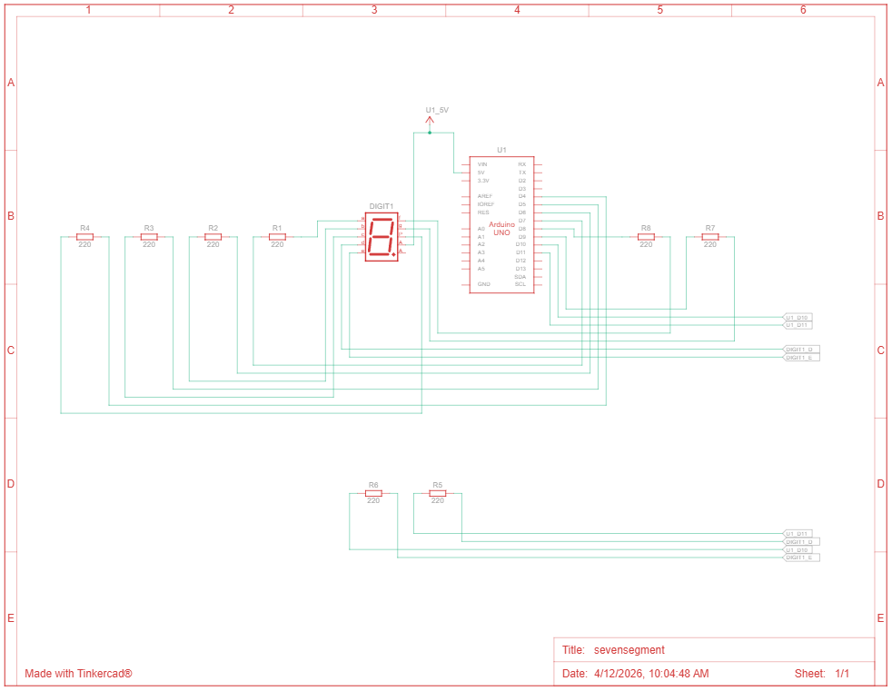

# 📘 Praktikum Sistem Tertanam - Modul 2 Seven Segment

## Pertanyaan Praktikum

1. Gambarkan rangkaian schematic yang digunakan pada percobaan!
2. Apa yang terjadi jika nilai num lebih dari 15?
3. Apakah program ini menggunakan common cathode atau common anode? Jelaskan alasanya!
4. Modifikasi program agar tampilan berjalan dari F ke 0 dan berikan penjelasan disetiap baris kode nya dalam bentuk README.md!
5. Bagaimana prinsip kerja dari Seven Segment Display dalam menampilkan angka dan karakter?
6. Uraikan hasil tugas pada praktikum yang telah dilakukan pada percobaan ini!

---

## ✅ Jawaban

### 1. Rangkaian schematic yang digunakan pada percobaan



### 2. Apa yang terjadi jika nilai num lebih dari 15?
Jika nilai `num` dipanggil dengan nilai lebih dari 15 (sedangkan array `digitPattern` hanya memiliki indeks 0 hingga 15), program akan mengakses area memori di luar batas array (*Out of Bounds* / *Out of Range*). Hal ini bisa menyebabkan segment menampilkan pola error/acak atau bahkan membaca memori lain yang tidak terdefinisi sehingga merusak keluaran display.

### 3. Apakah program menggunakan common cathode atau common anode?
Berdasarkan sintaks `digitalWrite(segmentPins[i], !digitPattern[num][i]);` pada program, logika yang dikirimkan ke pin telah dibalik secara program (not / negasi). Karena digit pattern yang ditulis mengkonfigurasi nyala/mati secara logika *Common Cathode* (misalnya angka 0 yaitu `1,1,1,1,1,1,0,0` dimana 1 berarti menyala), namun karena dibalik dengan NOT (`!`), logika 1 menjadi *LOW* dan 0 menjadi *HIGH*. Oleh karena itu, *Hardware* / rangkaian yang digunakan sebenarnya adalah tipe **Common Anode**. Pada *Common Anode*, pin common (common voltage) dari Seven Segment terhubung dengan VCC (+5V), maka dari itu dibutuhkan logika `LOW` dari mikrokontroler pin untuk dapat mengalirkan arus agar menyala.

### 4. Modifikasi program agar tampilan berjalan dari F ke 0

### 📌 Source Code

```cpp
const int segmentPins[8] = {7,6,5,11,10,8,9,4};
byte digitPattern[16][8] = {
  {1,1,1,1,1,1,0,0}, // 0
  {0,1,1,0,0,0,0,0}, // 1
  {1,1,0,1,1,0,1,0}, // 2
  {1,1,1,1,0,0,1,0}, // 3
  {0,1,1,0,0,1,1,0}, // 4
  {1,0,1,1,0,1,1,0}, // 5
  {1,0,1,1,1,1,1,0}, // 6
  {1,1,1,0,0,0,0,0}, // 7
  {1,1,1,1,1,1,1,0}, // 8
  {1,1,1,1,0,1,1,0}, // 9
  {1,1,1,0,1,1,1,0}, // A
  {0,0,1,1,1,1,1,0}, // b
  {1,0,0,1,1,1,0,0}, // C
  {0,1,1,1,1,0,1,0}, // d
  {1,0,0,1,1,1,1,0}, // E
  {1,0,0,0,1,1,1,0}  // F
};

void displayDigit(int num){
  // Looping untuk mengakses 8 pin segmen satu per satu
  for(int i=0;i<8;i++){
    // Menyalakan atau mematikan segmen sesuai dengan pola array (logika dibalik karena Common Anode menggunakan operator '!')
    digitalWrite(segmentPins[i], !digitPattern[num][i]);
  }
}

void setup() {
  // Inisialisasi setiap pin segmen sebagai OUTPUT
  for(int i=0;i<8;i++){
    pinMode(segmentPins[i], OUTPUT);
  }
}

void loop() {
  // Looping menurun dari indeks 15 (F) ke indeks 0 (0)
  for(int i=15;i>=0;i--){
    displayDigit(i); // Memanggil fungsi untuk menampilkan angka
    delay(1000);     // Memberikan jeda 1 detik tiap pergantian angka
  }
}
```

### 5. Prinsip kerja dari Seven Segment Display dalam menampilkan angka dan karakter
Seven Segment Display pada dasarnya berprinsip menyerupai delapan buah LED (termasuk titik/dp) individual yang dirangkai sedemikian rupa sehingga membentuk pola fisik angka delapan. Untuk menampilkannya kita mengubah variasi sinyal output (memberi arus antara logika saklar HIGH atau LOW tergantung jenisnya (terbagi dalam Common Anode atau Common Cathode)) yang akan menghidupkan pin segmen LED tertentu (contohnya untuk mencetak pola angka '1', menyalakan segmen B dan C, lalu mematikan sisanya), sehingga membentuk representasi ilusi visual dari karakter tertentu semisal 0-9 atau karakter huruf A-F.

### 6. Uraian hasil tugas pada praktikum
Pada **Percobaan 2A**: Kita berhasil mendemonstrasikan display komponen Seven Segment yang beroperasi sebagai *counter* mandiri (memutar dan mendisplay angka 0-9 kemudian abjad hexadecimal A-F secara urut/otomatis) dengan memanfaatkan perulangan *for loop* konstan. Kita mengefisienkan kode agar hanya menggunakan tabel Array 2D sehingga memetakan output nyala LED secara otomatis berdasarkan *mapping* tipe segmen.
